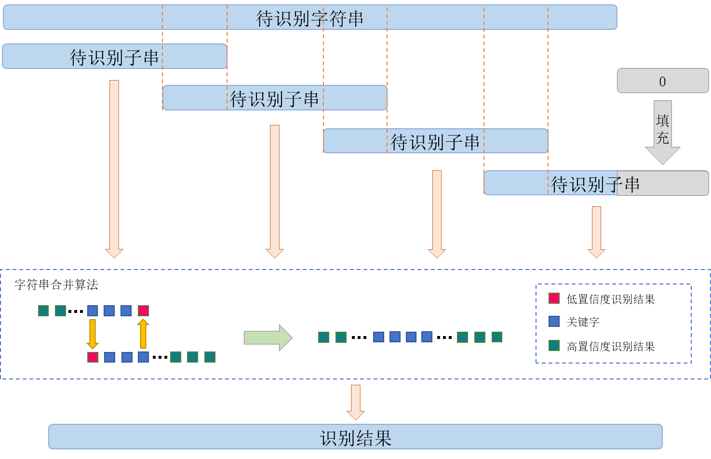

# Overlapping-Recognition
# 即插即用的叠瓦识别策略！
A flexible and easy-to-use strategy to adapt your end-to-end recognizer on arbitary length input images!

在推理阶段对矫正后的过长文本串图像以长度512、步长256的方式，分段使用端到端进行识别，从而避免了因文本串过长导致的过度放缩或二次切分。从图中可以看出，待识别子串两端存在一定长度重叠区域(图中红色虚线内区域)，而错误切分的字丁只可能位于待识别字串的第一个或最后一个位置，因此只需重复迭代即可整合得到最终的结果。最后一个待识别文本串图像宽度不足的部分将使用0值进行填充。不难看出，叠瓦识别策略可以通过“即插即用”的方式，在不对网络模型做任何修改的前提下，利用未经切分字丁的识别结果修正了可能被错误切分字丁的识别结果，有助于提高过长文本串的识别正确率。

